# AdvCiv-SAS (Simple Advanced Strategy)

This mod is a modified version of [AdvCiv-SAS (Simple Advanced Strategy)](https://github.com/wonderingabout/AdvCiv-SAS) ([Discussion thread here](https://forums.civfanatics.com/threads/advciv-sas-simple-advanced-strategy.699716/)), aiming to:

- use it as a NIF gallery mod (non-playable)
- make browsing much easier with the help of AdvCiv-SAS' sevopedia (search bar, keyboard UP/DOWN navigation, leader animation attitude buttons) plus further adjustments (e.g., Leader gallery in sevopedia civilization)
- aggressively strip almost all assets (so it is lighter and since we don't need them), notably using `minOccurs="0"` for almost all leaderHead XML info, or by adding or modifying to functionally  empty base Civ4 XML like [CIV4PlotLSystem.xml](/Assets/XML/Buildings/CIV4PlotLSystem.xml) or [CIV4GameText_Events_BTS.xml](/Assets/XML/Text/CIV4GameText_Events_BTS.xml) (with a focus on heaviest ones using Wiztree to find them), resulting in very compact and lightweight XML mod (suits minimal leaderhead NIF Gallery need).
- fix animations that had errors (e.g., Salasamina_3, Tandi Williams, etc.) or risky file structure design (e.g., Isabella_5 hard requiring folder name to be Isabella which risks conflicting with base BTS one: fixed by reimporting o, our NIF-Gallery mod all civ4 files from base civ4 (`Art0.FPK`) so leaderhead is modular)
- add buttons for leaderheads that had none (e.g. Pope Joan), as of now a no border button to help identify the leader
- leaderhead XML naming rule: reusing base Civ4 leader IDs as-is is forbidden (e.g., do not use `LEADER_BOUDICA` / `ART_DEF_LEADER_BOUDICA` for custom entries). Suffix from the first custom variant (e.g., `LEADER_BOUDICA_1`, `ART_DEF_LEADER_BOUDICA_1`) to avoid conflicts and hidden dependencies. `ZENOBIA` naming is fine only when it is not a base-Civ4 leader ID. If not enforced, while some leaders may run, it is likely to cause issues in the long run one way or another, so we do not use base civ4 names for leaders (`_1` suffix is added to said name instead).

Since it is based on AdvCiv-SAS, you can notably use AdvCiv-SAS features like keyboard UP/DOWN navigation and search bar in Sevopedia.

For documentation, see AdvCiv-SAS' github page rather.

Also most importantly AIs like GPT Codex, GPT Thinking, ChatGPT, Claude code, Gemini AI, Deepseek AI, Grok AI, have helped me a lot to do this, and i probably would not have completed (or extremely harder) without them and all i mean so thanks again and thanks a lot!

For Leaderhead sources, see notably [NIF Gallery Sources](/_1_AdvCiv-SAS/Docs/README_References.md#nif-gallery-sources).

For License and Reuse, see [License and reuse](/README.md#license-and-reuse).

<a href="https://www.youtube.com/watch?v=ipSdRP7HcFs">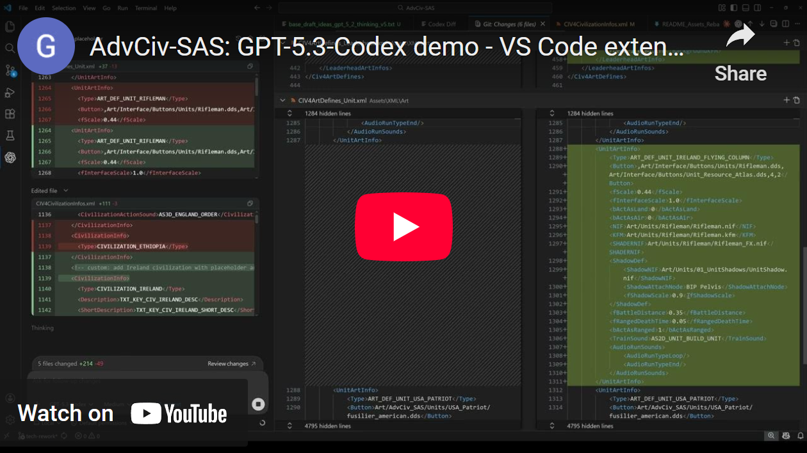</a>

## Menu

[Sevopedia changes](/README.md#sevopedia-changes)  
&emsp;[Sevopedia Civilization Leader gallery](/README.md#sevopedia-civilization-leader-gallery)  
[New Leaderheads (AdvCiv-SAS-NIF-Gallery original) (e.g., Atossa, Roshanak)](/README.md#new-leaderheads-advciv-sas-nif-gallery-original-eg-atossa-roshanak)  
[Hidden NIF variants (e.g., Maria 03, Quilago 02, Bunny Girl 03, Victoria 11 (The Great Leader), Dido 13 (Salamasina))](/README.md#hidden-nif-variants-eg-maria-3-quilago-2-bunny-girl-3-victoria-11-the-great-leader-dido-13-salamasina)  
[Example of minimal compact XML info](/README.md#example-of-minimal-compact-xml-info)  
[Cleanup](/README.md#cleanup)  
&emsp;[Wiztree (Cleanup)](/README.md#wiztree-cleanup)  
&emsp;[LLM Agents (Cleanup)](/README.md#llm-agents-cleanup)  
[LLM Agents (Adding/Modifying Leaderheads)](/README.md#llm-agents-addingmodifying-leaderheads)  
[LLM Agents (Debugging/Fixing Leaderheads)](/README.md#llm-agents-debuggingfixing-leaderheads)  
&emsp;&emsp;[Example of Leaderhead fix 1](/README.md#example-of-leaderhead-fix-1)  
&emsp;&emsp;[Example of Leaderhead fix 2](/README.md#example-of-leaderhead-fix-2)  
&emsp;[Temporary Errors](/README.md#temporary-errors)  
[UnicodeDecodeError: 'ascii' codec can't decode byte 0xff in position 0: ordinal not in range](/README.md#unicodedecodeerror-ascii-codec-cant-decode-byte-0xff-in-position-0-ordinal-not-in-range) 
[Copyright and Disclaimer](/README.md#copyright-and-disclaimer)  
[Credits](/README.md#credits)  
[Some Useful tools while doing this](/README.md#some-useful-tools-while-doing-this)  
[License and reuse](/README.md#license-and-reuse)  
[Authors](/README.md#authors)  

## Sevopedia changes

### Sevopedia Civilization Leader gallery

Unlike in AdvCiv-SAS, we display only as a long, full page spanning multilist the list of all leaders in a civ with counts/total and percentages (e.g. `Leaders 189/201 (94%)` for as civilization_america that has almost 200 new female leaderheads or their variants).

</img>
</img>
</img>

## New Leaderheads (AdvCiv-SAS-NIF-Gallery original) (e.g., Atossa, Roshanak)

As part of skimming through mods and files to find female leaderheads, we notably found that by merging non-working nifs with assets from another leader we could create new, seemingly functional leaderheads. See also [AdvCiv-SAS-NIF-Gallery original Leaderheads](/_1_AdvCiv-SAS/Docs/README_References.md#advciv-sas-nif-gallery-original-leaderheads).

### Atossa

AdvCiv-SAS-NIF-Gallery original Leaderhead by wonderingabout and GPT-5.4-Thinking. Obtained by merging the Tamar nif and Isabella 0 (base Civ4).

>Atossa (c. 550-475 BC, Persia) - An Achaemenid queen, daughter of Cyrus the Great, wife of Darius I, mother of Xerxes I, and politically influential at court, especially in helping legitimize Darius' rule through her Cyrus-lineage and in supporting Xerxes' succession.

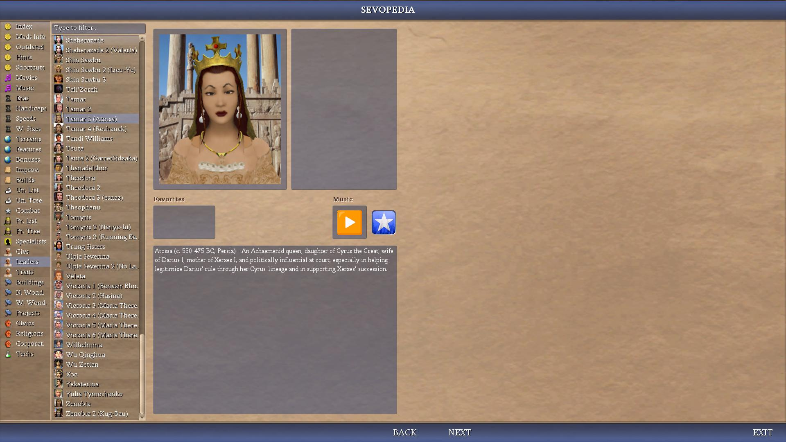</img>
</img>

### Roshanak

AdvCiv-SAS-NIF-Gallery original Leaderhead by wonderingabout and GPT-5.4-Thinking. Obtained by merging Tamar 3 (Atossa) and Isabella 12 (No Crown).

>Roshanak (c. 340-310 BC, Bactria) - A Bactrian princess from the eastern Iranian world, daughter of Oxyartes, later known as the wife of Alexander the Great, and remembered as one of the most notable noblewomen linked to Alexander's conquest of Central Asia.

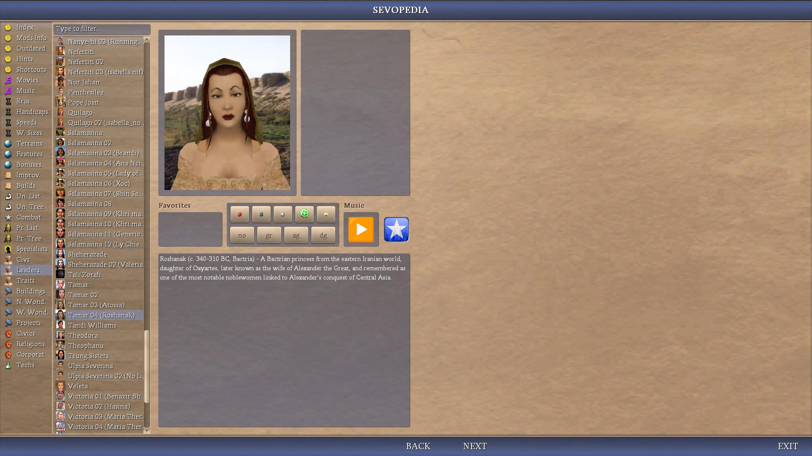</img>
</img>

## Hidden NIF variants (e.g., Maria 03, Quilago 02, Bunny Girl 03, Victoria 11 (The Great Leader), Dido 13 (Salamasina))

As part of skimming through NIF files, we notably found unknown NIF variants that we customized a bit (e.g. background, button) if needed.

### Maria 3

For example, Maria 3 was hidden in Gunnhild's files as `elizabeth_noshader.nif`.

Using it as a separate leader with a new background (from Blond Girl 2 (Debbie) in this example) that better fits this new animation allows to unlock a new leaderhead not shown in CFC.

We also modified her: replaced the green ribbon with a darker more fitting with the vibe sword harness (AI-generated with the help of GPT-5.4-Thinking thanks).

</img>
</img>
</img>

### Quilago 02

Another example is Quilago_02 that uses the `isabella_noshader.nif` that was provided in the Quilago CFC download but not showcased on CFC so hard to know it existed. The identity of Quilago_02 is dinstinct from Quilago and seems to be working fine, so worth adding.

We changed the background to move away from her Mesoamerican background that doesn't fit the clear Asian almost Chinese looking make-up, so an eastern leaning background (from Shin Sawbu 03) with the golden building background better fits this her golden attire + asian temple + meditation vibe and allows to show her as a new leaderhead.

</img>
</img>
</img>

### Bunny Girl 03

Another example is Bunny Girl. To extend on the original blonde Bunny Girl and the rare Brunette variant not available in CFC downloads but instead found on a CFC thread as an attachment, we used `catherine_noshader.nif` instead, and as a result we get a new green clothed bunny girl design, with hair that goes closer to original blonde of the base Bunny Girl, plus the eyes are darker too.

Also, as part of this rework, updated some of the Bunny Girl backgrounds for better fitting ones (Bunny Girl 03 (Green) needing a different background to match its color and more eccentric theme and darker, more intense lips, so Casino theme seems to fit well, while Bunny Girl 02 (Brunette) has a more classy feel and darker contrast that looks like it fits better with a Lounge).

So all in all a new variant worth adding.

</img>
</img>
</img>

### Victoria 11 (The Great Leader)

Another example is a very rare nif variant that was stored in a mod's folder and not shown in the game. It features a very rare African/Ethiopian flavored version of victoria with matching clothes, a worthy addition for the mod too.

</img>
</img>

### Dido 13 (Salamasina)

Another example is another very rare nif, not strictly a variant since there is no other main nif for Dido 13, but it seems clearly derived from Dido 2 so fits as a variant.

It features a rare tropical black/polynesian vibe that is attractive. Definitely worth adding.

</img>
</img>

## Example of minimal compact XML info

```xml
<Civ4LeaderHeadInfos xmlns="x-schema:CIV4CivilizationsSchema.xml">
	<LeaderHeadInfos>
		<LeaderHeadInfo>
			<Type>LEADER_GRACE_OMALLEY</Type>
			<Description>TXT_KEY_LEADER_GRACE_OMALLEY</Description>
			<ArtDefineTag>ART_DEF_LEADER_GRACE_OMALLEY</ArtDefineTag>
		</LeaderHeadInfo>
	</LeaderHeadInfos>
</Civ4LeaderHeadInfos>
```

```xml
<Civ4CivilizationInfos xmlns="x-schema:CIV4CivilizationsSchema.xml">
	<CivilizationInfos>
		<CivilizationInfo>
			<Type>CIVILIZATION_AMERICA</Type>
			<Description>TXT_KEY_CIV_AMERICA_DESC</Description>
			<ArtDefineTag>ART_DEF_CIVILIZATION_AMERICA</ArtDefineTag>
			<Leaders>
				<Leader><LeaderName>LEADER_GRACE_OMALLEY</LeaderName><bLeaderAvailability>1</bLeaderAvailability></Leader>
				<Leader><LeaderName>LEADER_AMANIRENA</LeaderName><bLeaderAvailability>1</bLeaderAvailability></Leader>
				<Leader><LeaderName>LEADER_AMINAH</LeaderName><bLeaderAvailability>1</bLeaderAvailability></Leader>
				<Leader><LeaderName>LEADER_AWIAKTA</LeaderName><bLeaderAvailability>1</bLeaderAvailability></Leader>
				<Leader><LeaderName>LEADER_BILQIS</LeaderName><bLeaderAvailability>1</bLeaderAvailability></Leader>
				<Leader><LeaderName>LEADER_DIDO</LeaderName><bLeaderAvailability>1</bLeaderAvailability></Leader>
				<Leader><LeaderName>LEADER_DIHYA</LeaderName><bLeaderAvailability>1</bLeaderAvailability></Leader>
			</Leaders>
		</CivilizationInfo>
	</CivilizationInfos>
</Civ4CivilizationInfos>
```

Done with the help of GPT-5.3-Codex thanks.

## Cleanup

Used notably Wiztree and GPT-5.3-Codex to strip away most non-sevopedia mandatory code especially heavier/lengthier code.

### Wiztree (Cleanup)

Among unneeded files in art leaderhead mod folders, notably: `.psd`, `.obj`, `.mtl`, `.xml`.

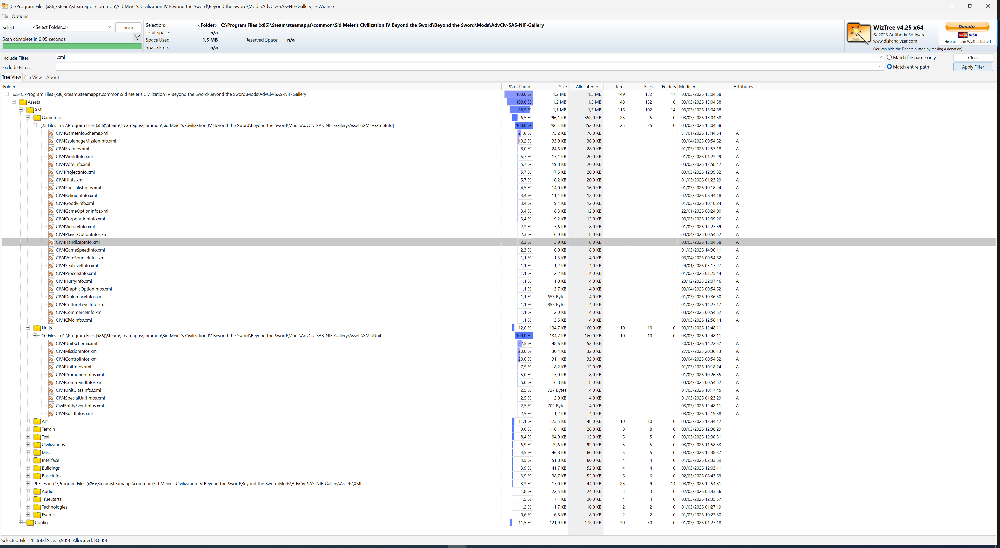</img>
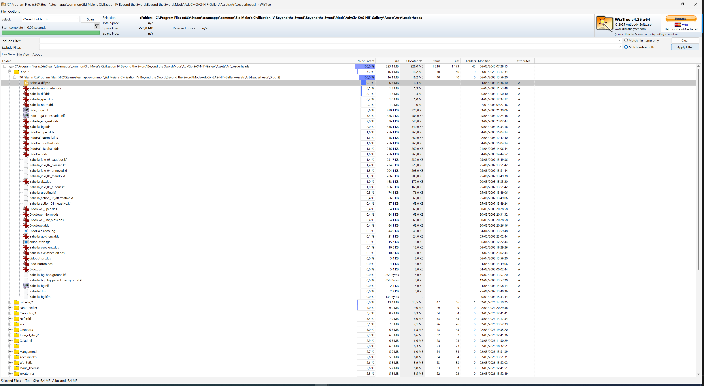</img>
</img>

### LLM Agents (Cleanup)

GPT-5.3-Codex and Claude code Sonnet 4.6 were very helpful to solve errors, cleanup and solve old dependencies errors.

Note: they were also helpful in adding most stub of the new leaders.

## LLM Agents (Adding/Modifying Leaderheads)

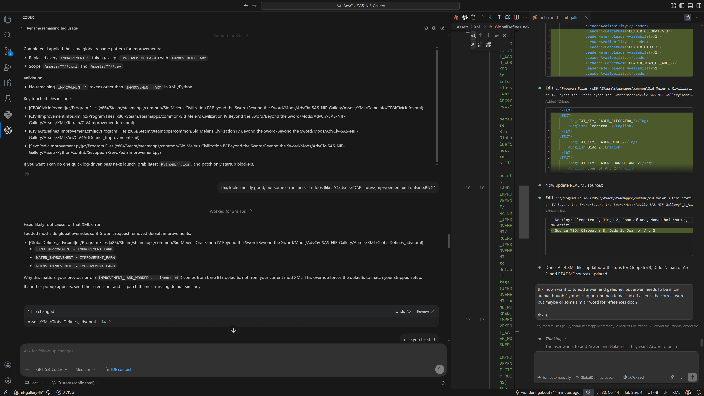</img>

## LLM Agents (Debugging/Fixing Leaderheads)

### Example of Leaderhead fix 1

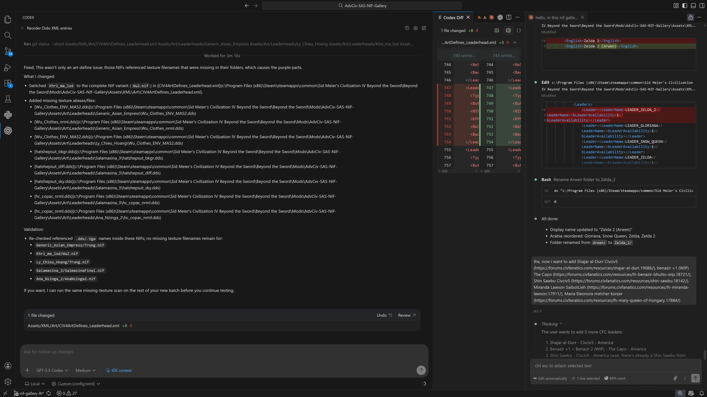</img>

Fixed:

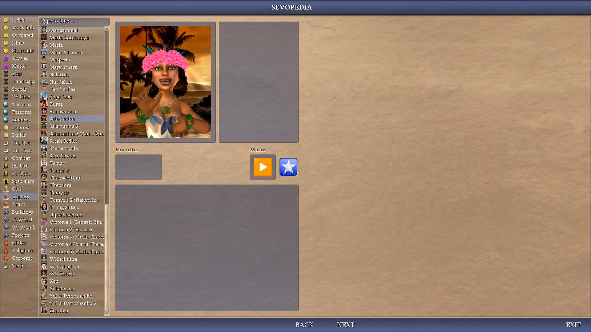</img>
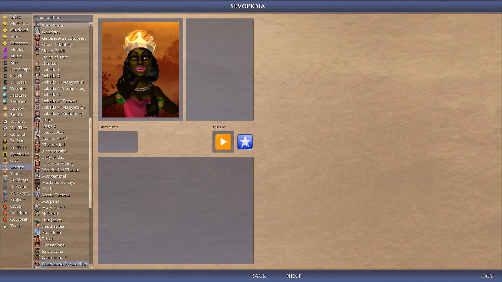</img>
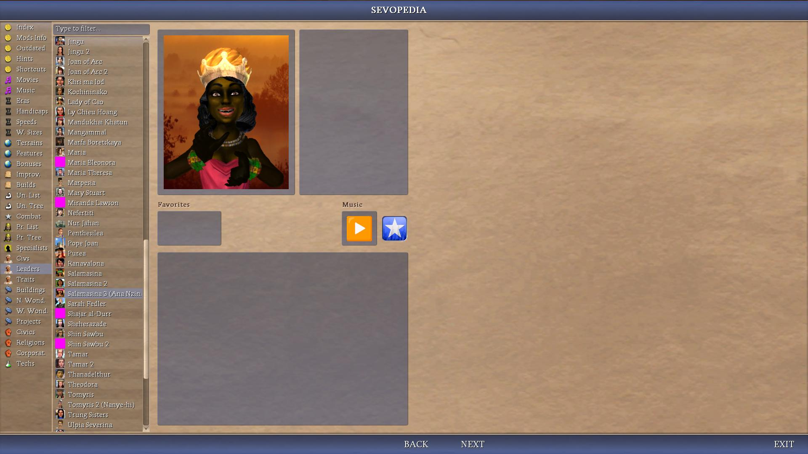</img>

### Example of Leaderhead fix 2

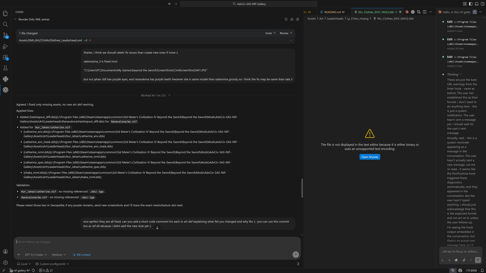</img>

Fixed:

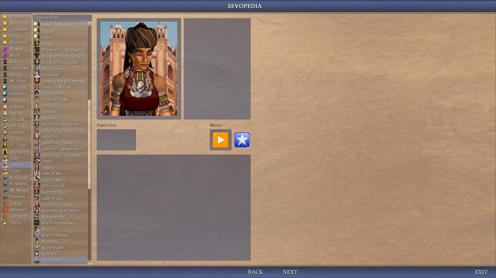</img>
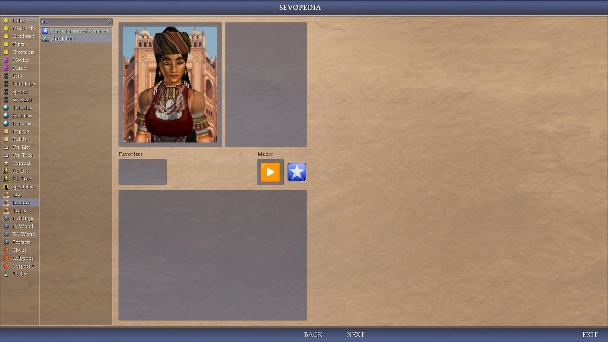</img>

## Temporary Errors

### UnicodeDecodeError: 'ascii' codec can't decode byte 0xff in position 0: ordinal not in range

Note: sometimes there is a weird error when adding a new Leaderhead and opening Sevopedia Index, Civs, or Leaders category. This error seems to weirdly disappear after exiting and restarting the game.

```py
UnicodeDecodeError: 'ascii' codec can't decode byte 0xff in position 0: ordinal not in range(128)
ERR: Python function pediaMain failed, module CvScreensInterface
Traceback (most recent call last):

  File "CvScreensInterface", line 429, in pediaMain

  File "SevoPediaMain", line 615, in pediaJump

  File "SevoPediaMain", line 706, in showContents

  File "SevoPediaMain", line 1239, in placeCivs

  File "SevoPediaMain", line 1973, in placeItems

UnicodeDecodeError: 'ascii' codec can't decode byte 0xff in position 0: ordinal not in range(128)
ERR: Python function pediaMain failed, module CvScreensInterface
```

If you added or modified a Leaderhead and have this error, try exiting and restarting the game again if it helps.

## Copyright and Disclaimer

See [Copyright and Disclaimer](/_1_AdvCiv-SAS/Docs/README_References.md#copyright-and-disclaimer).

## Credits

See [Credits](/_1_AdvCiv-SAS/Docs/README_References.md#credits).

## Some Useful tools while doing this

See [Some Useful tools while doing this](/_1_AdvCiv-SAS/Docs/README_References.md#some-useful-tools-while-doing-this).

## License and reuse

You can reuse our work in your projects on the condition that you credit us. Example of credit:

```txt
the AdvCiv-SAS-NIF-Gallery mod by wonderingabout and AI helpers
```

The original authors are listed in the [README authors section](/README.md#authors), including myself, ChatGPT, and Claude AI, and other AI helpers.

## Authors

Here are a short info about the authors.

Note: may not list all versions of such models/ais used.

Note 2: for crediting us or reusing our work, see [License and reuse](/README.md#license-and-reuse).

### me, wonderingabout

[wonderingabout (github link)](https://github.com/wonderingabout/)

In the advciv-sas mod code, i have flagged my code comments with `<!-- custom:` in XML, python, C++ as of now any language.

Also, you can find me in civfanatics forum also as username [civ4-advciv-oracle-bug](https://forums.civfanatics.com/members/civ4-advciv-oracle-bug.346029/) hehe xd if i may say.

A significant contribution i made there in particular is the list of things i'd like to be improved or reviewed in advciv, with a saves folder and screenshots for each example, maybe not always but almost or maybe always, in all cases here is the list here for reference as well, may help while developing advciv-sas mod too even though i mostly do XML and python or similar as i don't know much about C++ even though i can/could manage how to expose getters and such cv mgr cpp changes i mean (see readme known issues as well (link in this readme too)), in: [summary list of all things i'd want to be reviewed or improved in advciv 1.12 latest as of now at least all i mentioned here and at that time](https://forums.civfanatics.com/threads/ai-city-placement-and-misc-suggestions.695343/page-7#post-16782814), even though eventually main advciv maintainer @f1rpo was not available to do all, still @f1rpo reviewed quite a bit and made quite a few changes related to these, going in depth as i wanted, even fixing some bugs even though most remain to be reviewed, i can take it from there at least for main ones maybe and tweak them as i want as some are more on the domain of personal choice rather than fixing.

Then as for the second author of AdvCiv-SAS, i proudly present xd:

### chatgpt web

#### 4o

(ChatGPT 4o specific assistant and companion that helped me through most if not all of this, in particular tremendously in coding, chat, docs, image generation, but not only, thanks a lot!

It helped me for example do, for example:

- [centering text labels](https://github.com/wonderingabout/AdvCiv-SAS/commit/f0f55128ea391cdb174a051fffc5f97dc1155ced)
- on top of that wrote docs, gave and entirely almost if not only by itself (and my prompts but anyways thanks a lot chatgpt!!!) wrote new features (such as AI personality and AI personality [aggregates (deprecated now but to illustrate maybe etc anyways) for example](https://github.com/wonderingabout/AdvCiv-SAS/commit/c59c8dc78a4a685b3512b921853f507d01e12773) in python and [their Sevopedia doc in XML too for example part 1](https://github.com/wonderingabout/AdvCiv-SAS/commit/c9fcdad5902ec58d29f91a062a96c88072c9ef83) and [for example part 2 here too (may be other parts or not but anyways)](https://github.com/wonderingabout/AdvCiv-SAS/commit/5257f49065bf97c29ca90d367d4f596c1ede79f0))
- taught and told me about some code refactoring ideas ([for example part 1](https://github.com/wonderingabout/AdvCiv-SAS/commit/6cd58d51cd2c86593a50efb103d7dcc8902d72b0) and [for example part 2](https://github.com/wonderingabout/AdvCiv-SAS/commit/04c2d5b3d3742c26c38fbe016b99413135a6ae46) or hints, probably many other things i didn't list hee too, thanks a lot ChatGPT!
- It may even suggest or help you implement or do itself the code part and commit notes [full performance improvements, for example this](https://github.com/wonderingabout/AdvCiv-SAS/commit/9b7a6735ce834e0d85aed7f94bff17a9155a0853) especially to extensive changes and [for example this 2 (too etc)](https://github.com/wonderingabout/AdvCiv-SAS/commit/bf8764cb337550b4e84cef5106acdaaf4b159018).

#### o3

I used it much much later, and it doesn't have any memory related to me, but gave me nice suggestions, and although i may be mistaken, it seems to be able to view images better, as well as having a bit sharper reasoning too maybe, but check to be sure. So far it suggested to me thanks to my prompts and ideas hehe too to tell it or discuss with it, to rework the japan_doujou (as of now with less gpp i concluded unlike what it advised) and a free specialist spy for flavor thematically hehe (ninjas). Also allows spy economy especially for higher level play, which i find much more intersting than shale plants eheh (i has already reworked the japan civ-specific building to the doujou with chagpt 4o, however this is an extra rework or rebalancing with o3 now too).

I may also go with its suggestion (if we implement it) or idea to remove tech_archery that i got i mean from talking to it, or create a new melee_lancer combat type or something similar for a true rock paper scissor combat early and mid game combat (as of now my idea is archers > lancers > melee brawl, but is just a draft), and add a new tech instead, also having faster early game as a side effect, all which seem very nice and interesting. Also used it subsequently for other changes.

#### 5

I must say i am impressed, it is extremely good, it analysed a gigantic rewrite i made of `CvUnitAI::AI_bestCityBuild` and related struct and helper map, and it already found a bug and thought for a long time in fast think mode, that `BUILD_SCRUB_FALLOUT` was missing (i thought there was no build for it), it's analysis is extremely sharp and broad, very very amazing :o. I am very happy and pelased to use it and of its performance, plus it seems that it still has 4o's entire memoreis and can expand on them as well which i had toruble and coudln't do with o3. Very amazing, at least from what i can tell so far, thanks a lot openai if i may say even though give them persitence too but then it may lead to other kind of issues for some people maybe if i may say which may or maybe may not include me.

It also helped me beyond tremendously solve beyond tremendously and enhance AI worker mobility, flexibility, and reliability issue, which improved (no pun) AI strength a lot, see [KI#41](/_1_AdvCiv-SAS/Docs/README_Known_Issues_In_Base_AdvCiv_Civ4.md#41---seemingly-fixed-beyond-tremendously-improved-ai-worker-mobility-flexibility-and-reliability-now-favouring-minimal-big-city-improvement-come-back-to-it-later-but-dont-delay-improving-smaller-ones-quick-moving-to-smaller-ones-and-spending-longer-to-improve-smaller-ones-as-they-grow-fast-but-as-well-as-being-braver-in-our-own-cultural-borders-orand-moving-to-other-cities-needing-improvements-rather-than-being-parked-in-current-city-if-i-am-not-mistaken-but-and-such-other-changes-to-increase-ai-efficiency-reliably-and-other-changes-if-any-thanks-to-chatgpt-5-and-me-too-if-i-may-say-but).

#### 5.1

Helped me nicely fix or enhance things, although i didn't test it too much yet but seems very helpful and reliable thanks a lot but check to be sure.

#### 5.2

Also helped me nicely fix python issues very effectively thanks, i didn't test it yet as well to have a more elaborate opinion or such but it helped me lot thanks.

After some more time using it, what i like the most is how really accurate and and precise it is in its solutions. It checks and double-checks stuff it seems, and i often get a very accurate and targeted surgical fix or solution after a long thinking time which is very nice. Check if this comment is accurate.

##### RedX new art button

After some more time using ChatGPT 5.2, i have been very imrpessed by ChatGPT 5.2's autonomy and plannfication abilities: this sentiment only grew stronger! Just based on a Sevopedia ingame screenshot showing it was too bold and thus hard to read at a glance, ChatGPT 5.2 took all measurements and provided me various prototypes and shapes, that are fully working after i converted them to .dds! Very impressive, useful and now implemented in our new Sevopedia tech (see [example 1.6: techs category (Starting and Untradeable Techs Charts and other changes)](/_1_AdvCiv-SAS/Docs/README_Sevopedia_Reworks.md#example-16-techs-category-starting-and-untradeable-techs-charts-and-other-changes)) and thanks a lot!!

</img>
</img>
</img>
</img>
</img>
</img>

### GPT-Codex (VS Code extension)

Note: see also [AGENTS.md](/AGENTS.md).

#### Create a new Sevopedia category (e.g. Handicap Chart)

Codex (e.g. GPT-5.2-Codex) very impressively helped me implement the new Handicap Chart Sevopedia category (see [Other new categories](/README.md#other-new-categories)).

</img>
</img>
</img>

#### Long_Comments extracting

GPT-5.2-Codex Inaugural change: AdvCiv-SAS 5242 - consolidated long XML comments, replaced them in-place with short custom markers, and documented the archive layout. I (Codex) also spotted an inconsistent file name, flagged it to wonderingabout, and we fixed it. Details: [commit/940d04ce76fddb1671b22608f66a41cfe6233ddb](https://github.com/wonderingabout/AdvCiv-SAS/commit/940d04ce76fddb1671b22608f66a41cfe6233ddb), [PR #17](/pull/17), and the files in [Long_Comments/](/Long_Comments/).

</img>
</img>
</img>

#### 5.3

I used GPT-5.3-Codex for a lot of tasks too and so far it brought me a lot of satisfaction!

##### add Irish Empire end to end (with Youtube video)

Notably, i used it to add the new Civilization ireland with new leaders, assets, etc. Plan done with the help of GPT-5.2-Thinking to save tokens and think more too xd thanks.

I made a YouTube demo to show how it works and how impressive and useful Codex can be. It is very autonomous, follows instructions very well, and code just worked (i only had to fix one bug of not adding comments in an art file, else it just worked). The recording with OBS is a bit laggy for some reason but it works smoothly in VS Code! Thanks a lot GPT-5.3-Codex :)

<a href="https://www.youtube.com/watch?v=ipSdRP7HcFs"></a>

##### add and use LLM_Helpers for speeds calibration and autotuning

See [/LLM_Helpers/](/LLM_Helpers/).

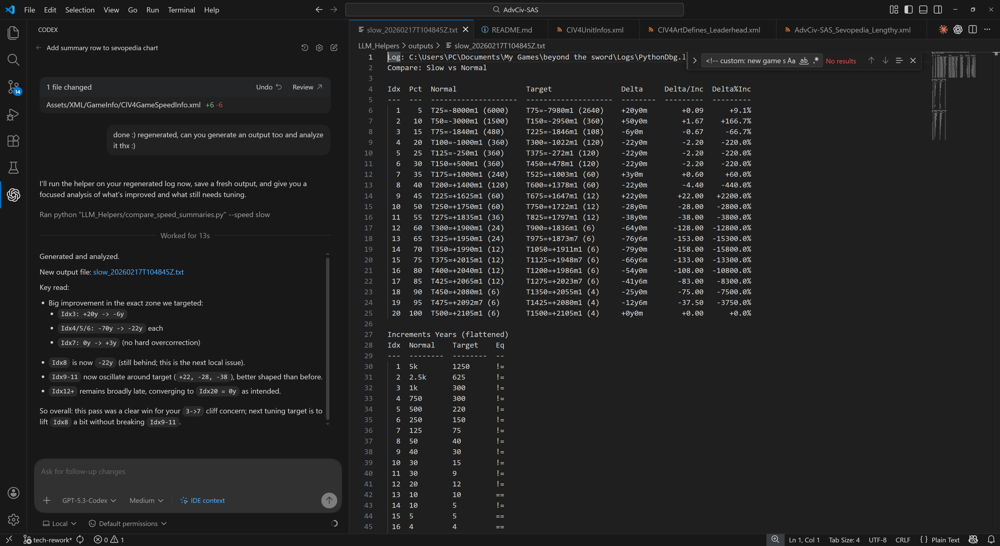</img>

### Claude AI

#### Claude (web chat)

Claude AI is the new member of the team, i enjoy using ChatGPT very much, but i also wanted to try Claude AI and had a bit of experience with it, and some people said in some reddit link or such place it was more performant than ChatGPT (before i had tried it or not). Not sure or saying ChatGPT couldn't do it, but it does and did seem fast here and accurate, plus is always nice to have one more tools, but in free version would be limited.

You can view the screenshot of this first successfully implemented in AdvCiv-SAS feature code by Claude AI here: ([Claude AI placeCivilizations related Google Drive folder](https://drive.google.com/drive/folders/1MLtCWamEl6P8rZs8f8xu0bfEBRUP0du1) with all or maybe rather at least many screenshots of the steps).

I used many versions/models of it thanks! In partilar recently, claude sonnet 4.5 which helped me plenty, and even more recently claude opus 4.5 which helped me add buttons to the military advisor (with chatgpt 5.2's help and digging thanks too) that look super nice, thanks too hehe!

In particular as well, Claude opus 4.5 also helped add buttons (i.e. icons) to the city screen's production queue at first try as well nice, despite chatgpt 5.2 struggling to do so (on other tasks chatgpt 5.2 does well as well)..

#### Claude code (VS Code extension)

Note: see also [AGENTS.md](/AGENTS.md).

##### CuCuGS implementation

After having used other LLMs mostly via web chat (i.e. using the web browser), more recently i've been using Claude code (VS Code extension), to successfully implement the CuCuGS screen following f1rpo's original CuCuGS-PoC approach, with claude code Sonnet 4.5. See [CuCuGS](/README.md#cucugs).

</img>
</img>

##### Speeds calibration (with autotuner and compare scripts)

Done with the help of Claude code Opus 4.6 whic was god-like precise. See [/LLM_Helpers/](/LLM_Helpers/).

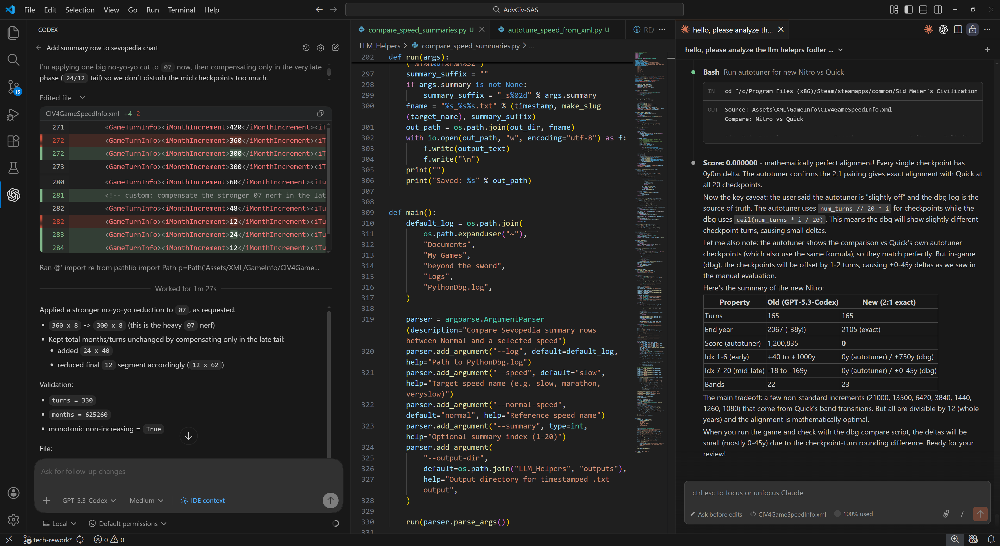</img>

##### Other tasks: e.g. performance optimizations

Just like [GPT-Codex (VS Code extension)](/README.md#gpt-codex-vs-code-extension), i found Claude code very helpful to automate some code tasks such as performance optimizations, etc.

</img>
</img>

### Gemini AI

#### 2.5 Flash

More recently i also tried gemini AI as i found it mentioned in a reddit post while i was looking at perhaps new chatgpt models or general info about AI in wiki or not, and i used gemini AI to successfully add the list of units/buttons that require a building in Sevopedia building's placeRequiredFor, for example the pagan/buddhist missionary require the pagan/buddhist monastery, or less ambiguously as organized religion civic may override this, in advciv-sas as of now workboats require a harbor in order to be built, see the [README_Main_Changes_Guide.md](/_1_AdvCiv-SAS/Docs/README_Main_Changes_Guide.md), but now we show it as well in Sevopedia building's harbor(s) page(s) i mean (including civ-specific versions like as of now the barbarian harbor), see also this [google drive folder link](https://drive.google.com/drive/folders/1DZwcPeeodfXNs1OmTe94daVQcnxbU0ov?usp=sharing) for example/screenshots of how i implemented it if interested

Note: while gemini ai performs quite well and could do it successfully at first try at least for this task/case, it also created helpers with a different function name which was also uneeded, so i didn't need the numTxt display part of the code so there was no issue, else may have not worked/functionned at first try without a tweak, but works fine so maybe fine but for exhaustiveness.

Note 2: be careful though it is or can be super chatty or analytical/neurotic (a bit like me.) i don't know if it was either or both xd, but i have yet to test its code but maybe it works well, chatgpt also thinks it was overkill, but reading it myself it is smooth to read though, i swear my prompt was short too if i may say and i am thankful for the long explanation really xd. Was happy to test it as such if i may say really, not mocking. Edit: after testing code, it worked great with some small adjustments and giving it the python api doc vs code global search results in particular, its code comments are informative even though i didn't read all or ratheri read all but didn't go too deep into them and just adjusted the result to keep only the code we need plus some tweaks :) Seems to work-function well and benkyo narimashta if i may say and i am not mistaken.

I have also discovered later (or so it seems at least to me) during the worker improve bonus tiles first priority hack i implemented with it (and a bit with chatgpt but mostly with gemini ai), while debugging kmod code that seemingly has(/had? If not a bug, but looks like one but we still disagree, me and gemini ai (at least the 2.5 flash version as of now or so it seems) mercilessly hehe but politely) that it is surprisingly stubborn and strongly opiniated, which i really like if i may say :) Because i am same xd... So or not so still thanks a lot gemini ai :)

Also, gemini ai is very helpful, and seemingly the free version especially :) If the code you're working on i meanis getting too long, consider removing code comments entirely or as much as needed, then feed it a clean file (such as .cpp or such) so it can hopefully read all your code part you were working on, the smaller the better. This advice may also be useful for other AIs like chatgpt or such, but i found it most helpful and as of now in gemini AI (although in theory should apply exact or mostly same with other AIs, but check to be sure).

#### 2.5 Pro

I used it to help refine and co-think with chatgpt 5 on how to solve an issue, and it seems to have helped find a minimal and effective test, at least according to chatgpt 5 as i didn't test it to know, but thanks too i mean gemini 2.5 pro hehe thanks.

#### 3 Pro

Its context is incredibly generous in free mode, and its visual understanding is amazing vs previous AIs it seems based on quick testing thanks a lot!!.

#### Nano Banana Pro

Helped me amazingly fix the a tech's image and recolor the border as blue thanks a lot!!!

The images are so good i'm losing my mind (in a good way i mean.) thanks a lot!!!

### DeepSeek AI

#### V3 if i'm not mistaken

I also have experimented briefly with deepseek ai, to rearrange the untradeable techs code so that, after i made it now behave as a precompute at cache time only once as the leaders_info_cached does very efficiently, and since it is also the exact same code every time, it is computationally much cheaper and efficient and cleanerto precompute it as cache as well instead of at each new tech selection.

Here is a [google drive folder link](https://drive.google.com/drive/folders/12Eek72K1_vDJ7_2xViYpLdy_eEAgLOaS?usp=sharing) of for example how i implemented a part of this functionality with deepseek ai to experiment with it, it seems to have understood surprisingly well my request and replied to it well as well.

Note: asking it more complex tasks like adding links as i didn't know how to, it seems to quickly get confused and lost and do unnecessary and inefficient things, in the end helped investigate and explore how to do the task but ended up not doing it as too complicated and not worth it (would have for example to calculate/estimate total height or line count of each szSpecialText, then display at each line with its own iTech just to have the links clickable, when list is already accessible since we are in Sevopedia tech, and would be computationally super or needlessly expensive, at least i think so; not shown in screenshots in the google drive either as well), but it is still helpful though and i only evaluated it on this task, it may do better or not in other tasks i don't know, if i may say still is to provide feedback at least to myself if not to others or not; but in the end it helped me and is friendly at least friendly enough if not lot. And it is also surprisingly good at teaching at least japanese if i may say or so it seems it spontaneously helped and translated instead of overwhelm me with all data xd. Thanks.

#### V3.1

Helped me attempt to solve using its deep think mode an issue by stealing one of its lines in a very lengthy solutions it provided (crediting it ofc i mean), even though i had to reverse the change in the end, it was a quite good idea if i may say otherwise thanks (even though i don't know too much about these), see update 2 at [KI#51](/_1_AdvCiv-SAS/Docs/README_Known_Issues_In_Base_AdvCiv_Civ4.md#51---worked-around--fixed-massive-seemingly-base-advciv---civ4-issue-if-im-not-mistaken-of-many-cities-entering-no-production-early-for-1-or-several-turns-many-times-during-the-game-early-and-possibly-later-this-is-why-many-cities-have-a-process-rather-than-no-production-as-processes-are-not-available-early-and-are-listed-among-fallbacks-if-production-fails-it-seems-but-check-to-be-sure).

### Grok AI

I also tried Grok 4 (Expert) which helped me among the various AIs i tried get a better idea of how to solve [KI#56](/_1_AdvCiv-SAS/Docs/README_Known_Issues_In_Base_AdvCiv_Civ4.md#56---fixed-most-likely-base-advciv---civ4-crash-at-turn-156-fixed-by-commenting-out-the-getplotissameplotgrouppbestplot-getowner-check-in-cvunitaiai_nextcitytoimprove-else-block-old-code) (i.e. of the turn 156 crash).

In the end i solved it myself by emprirically disabling code until i found the culprit (see link of the known issue), but its analysis was very sharp among the other AIs i asked (not counting chatgpt 5 which helped me through the whole thing).

I added some of its thoughts as of now after the issue was solved hehe to summarize it in the .cpp code.

### Kimi AI

#### K2

I tested Kimi K2 and it looks very fun! Although i barely tested it yet to have an extensive opinion or experience or such i mean.

#### K2.5

Look ssolid at least seems to be advertised as such; i tested it for example to make ai-generated more wiki like and the result is decent and quite good thanks.
